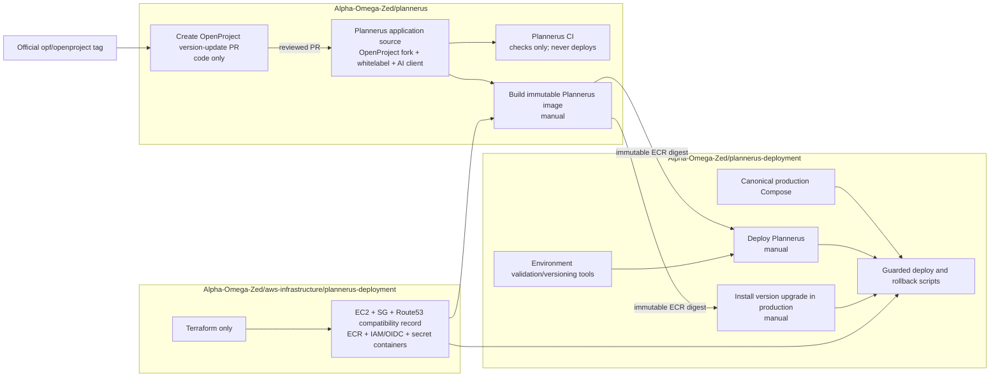
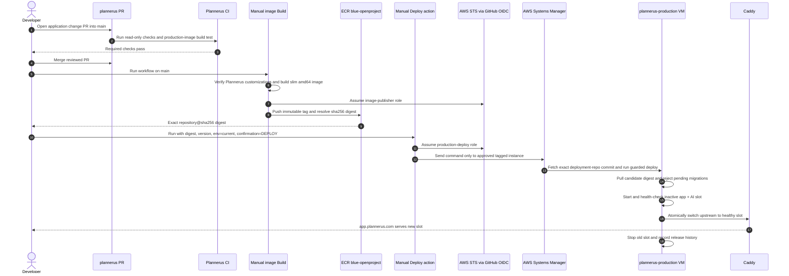
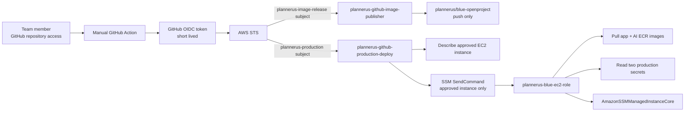
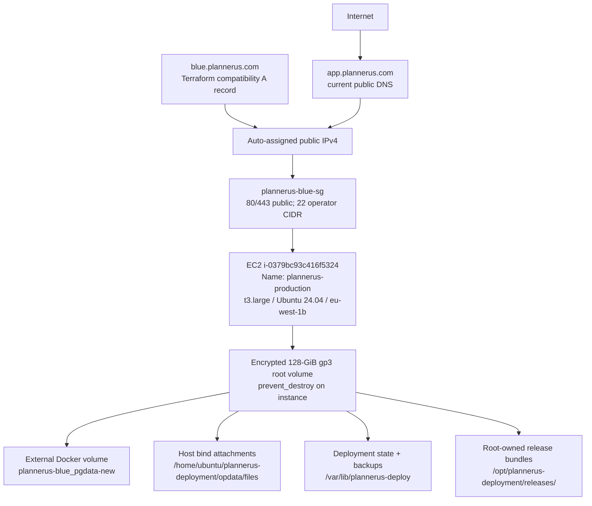
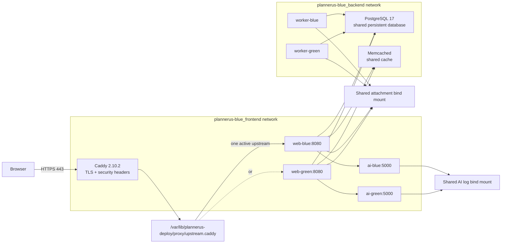
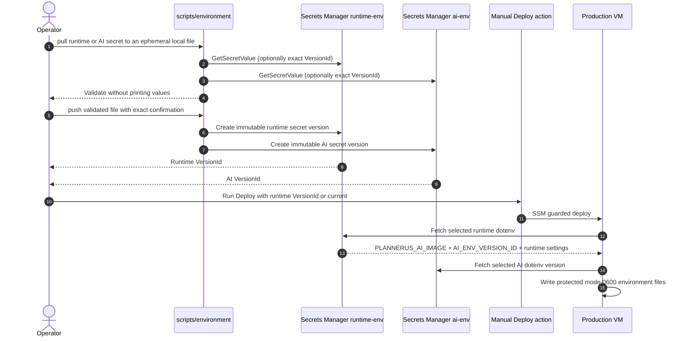
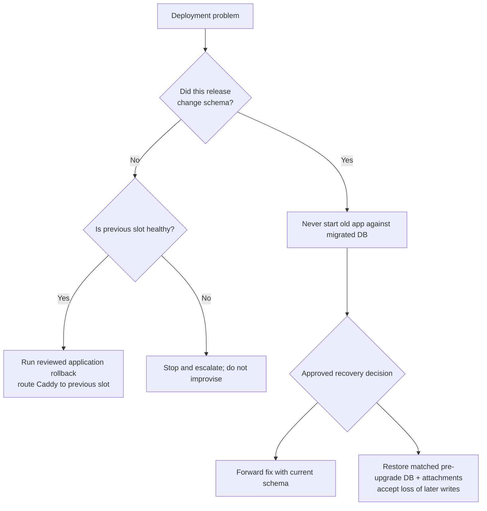

# Plannerus solution architecture

This document maps the complete Plannerus build, deployment, configuration,
runtime, version-update, and recovery solution. Day-to-day commands remain in
the repository [README](../README.md); this file explains how the parts connect.

## System boundary



Repository ownership is intentionally non-overlapping:

| Repository | Owns | Must not own |
| --- | --- | --- |
| `plannerus` | Application source, whitelabeling, AI client, source CI, application image Build, code-only OpenProject version-update PR | Production Compose, runtime secrets, database operations, Terraform |
| `plannerus-deployment` | Production Compose, Caddy routing, environment tools, manual Deploy, manual production version installation, guarded runtime and rollback scripts | Application source, image compilation, cloud provisioning |
| `aws-infrastructure/plannerus-deployment` | EC2, networking, ECR repositories, IAM/OIDC roles, empty Secrets Manager containers, historical compatibility DNS | Container rollout, application source, populated secret values |

There is one canonical production Compose model:
`plannerus-deployment/docker-compose.yml`. The application repository's root
Compose file is development-only.

## Developer-to-production release flow



Pushes and merges never publish or deploy. The only automatic workflows are
validation workflows with read-only repository permissions. Build, Deploy, and
production version installation use `workflow_dispatch` and require a human to
select **Run workflow**.

## AWS authentication and command path



No long-lived AWS access key is stored in GitHub. Developers need local company
AWS credentials only when changing a Secrets Manager value or Terraform. Local
identity must resolve to AWS account `583909165557`, region `eu-west-1`.

## Production infrastructure



Historical AWS resource names retain `blue`, but there is no separate blue
environment. The production hostname stays `app.plannerus.com`; blue and green
now mean container slots inside the same VM. A stop/start changes the VM's
auto-assigned public IPv4, so DNS must be checked and Terraform may need to
refresh its managed compatibility record.

Terraform state:

- bucket: `aoz-terraform-state`;
- key: `plannerus/terraform.tfstate`;
- region: `eu-west-1`;
- lock table: `aoz-infra-terraform-state-lock`.

## Single-VM blue/green runtime



Only Caddy publishes host ports. PostgreSQL, Memcached, application, AI, and
debug ports are not published. At steady state one web/worker/AI slot is active
and the other is the candidate/rollback slot. Both application slots share the
same database and attachments, so this design provides near-instant routing for
ordinary code releases but cannot provide zero-write-downtime schema migration.

Persistent names and paths are compatibility contracts and must not be renamed:

- Compose project: `plannerus-blue`;
- PostgreSQL volume: `plannerus-blue_pgdata-new`;
- Caddy volumes: `plannerus-blue_caddy_data`, `plannerus-blue_caddy_config`;
- attachments: `/home/ubuntu/plannerus-deployment/opdata/files`;
- AI environment: `/home/ubuntu/plannerus-deployment/backend/.env.production`;
- deployment state: `/var/lib/plannerus-deploy`.

## Configuration and secret flow



Secret containers:

| Secret | Purpose |
| --- | --- |
| `plannerus/production/runtime-env` | PostgreSQL connection/password, Rails secret, hostname/TLS, SMTP, worker/thread settings, persistent paths, immutable AI image digest, selected AI secret VersionId, Caddy contact |
| `plannerus/production/ai-env` | AI service server secret, database/integration settings, Google/OpenAI/OpenRouter credentials and models, mail/reCAPTCHA settings |

Terraform creates only the empty secret containers and never stores their
values in state. A VM edit is not authoritative and will be overwritten on the
next deployment. Populated environment files must never be committed, printed,
placed in a GitHub artifact, or passed as workflow inputs.

## OpenProject version update and production installation

```mermaid
sequenceDiagram
  autonumber
  actor Dev as Developer/reviewer
  participant SourceAction as Create version-update PR
  participant Upstream as Official OpenProject tag
  participant PR as Generated Plannerus PR
  participant CI as Plannerus CI
  participant Build as Manual Build
  participant Install as Manual production installation
  participant VM as Production VM
  participant Data as PostgreSQL + attachments

  Dev->>SourceAction: Enter exact vX.Y.Z tag
  SourceAction->>Upstream: Fetch exact official tag commit
  SourceAction->>PR: Merge into main candidate and preserve owned paths
  PR-->>Dev: List conflicts, UI overlaps, other customized seams, checklist
  Dev->>PR: Review each file; preserve whitelabel behavior
  PR->>CI: Run checks and non-publishing image build
  CI-->>Dev: Passing evidence
  Dev->>PR: Merge after review
  Dev->>Build: Build and publish exact digest
  Dev->>Install: Run with digest/version/env and UPGRADE confirmation
  Install->>VM: Validate target, current version, digest, DNS and migration state
  VM->>VM: Route Caddy to maintenance and stop writers
  VM->>Data: Capture counts and matched DB + attachment backup with checksums
  VM->>Data: Run candidate seeder/migrations once
  VM->>Data: Confirm no migrations remain and core counts match
  VM->>VM: Start inactive slot, health/smoke check, switch Caddy
```

The three stages are not alternatives:

1. **Create OpenProject version-update PR (code only)** changes source and never
   connects to production.
2. **Build immutable Plannerus image (manual)** produces an exact ECR digest.
3. **Install version upgrade in production (manual)** is the only stage that
   enters maintenance, backs up data, and runs migrations.

Downgrades and jumps over more than one OpenProject major version are rejected.
Major versions must be installed sequentially. A normal Deploy rejects an image
when migrations are pending and directs the operator to the production-install
action.

## Failure and rollback boundaries



Before a migration, the runtime creates:

- a custom-format PostgreSQL dump;
- a compressed attachment archive;
- a SHA-256 manifest;
- before/after core record counts.

These local backups are a migration checkpoint, not complete off-instance
disaster recovery. After a schema migration, container-only rollback is
forbidden. Database and attachments must always be restored as a matching pair.

## Control and data planes

| Plane | Components | Mutability |
| --- | --- | --- |
| Source | `plannerus` Git repository and reviewed PRs | Changed only through reviewed Git commits |
| Release | Immutable application ECR digest; immutable AI digest selected by runtime environment | Never deploy a mutable tag |
| Control | Manual GitHub Actions, OIDC roles, SSM command, root-owned release bundle | Serialized; exact `main` commit |
| Configuration | Versioned Secrets Manager payloads | New versions only; values never enter Git/Terraform |
| Routing | Caddy and atomic `upstream.caddy` state | Switches between healthy local slots |
| Data | PostgreSQL external volume and attachment bind mount | Shared by both slots; protected during migrations |
| Infrastructure | Terraform remote state and AWS resources | Changed only through reviewed Terraform plan/apply |

## Non-negotiable invariants

- Production domain: `app.plannerus.com`.
- AWS account: `583909165557`; region: `eu-west-1`.
- Approved EC2 instance: `i-0379bc93c416f5324` with tags
  `project_name=plannerus`, `Environment=blue` and display name
  `plannerus-production`.
- Build, Deploy, and production version installation are manual actions on
  `main`.
- Application and AI images must be exact ECR `@sha256:` references.
- Production Compose comes only from this repository.
- Database and attachments are never recreated during an ordinary deployment.
- Populated secrets are never stored in Git, Terraform state, workflow inputs,
  command output, or logs.
- `SECRET_KEY_BASE` is not casually rotated.
- OpenProject cron and IMAP remain disabled unless a separately reviewed change
  explicitly establishes otherwise.
- Old application images are never run against a migrated database.
- A failed or ambiguous identity, version, DNS, health, backup, migration, or
  data-count check stops the operation.

